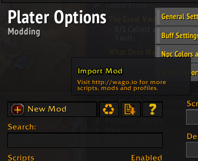
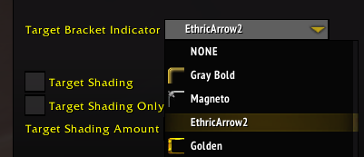

# Plater Arrows Mod for Plater 

This is a repo to maintain the import / code of the Arrow for plater profiles.

## Installing

> Note: Plater must be installed and working already. See [Platers install instructions](https://github.com/Tercioo/Plater-Nameplates) for further information on how to install / setup

1. Go to the `icons/` directory
2. Find which icon you would like to use for your current target icon
3. Download and save the `.tga` file to your WoW `_retail_\Interface\AddOns` directory
4. Open the plater application in WoW by typing `/plater` in a chat window
5. Select `Modding` tab in the top navigation
6. Next to `New Mod` click the Import Mod icon (Piece of paper with downward arrow)

    
7. Paste in the string from the [Mod String](#mod-string)
8. Look for the "Target Arrow(s)" mod in the list
9. Ensure it is enabled and select it from the list
10. Click on the `Constructor` hook and edit the `iconFileName` value to the name of your custom icon
11. Click the save button
12. Navigate to the `Target` tab
13. Select your custom icon in the `Target Bracket Indicator` area

    
14. Enter `/reload` in to the WoW chat to reload your UI
15. If done corectly, the icon of your choice should now be displayed when targeting

    


## Mod String
```vwvBpTTou4)l8LbsLQMcRaAAFabBABFOxKmsBiapBsoPXJu7iBhA5Ef(3(9y702uskBRvr5yNNZZ5vFmnHEnLKqjxZ1ZaRJDUwRwSV5akX(Cfqjfk1JuYruYLctvj)zhJ3GWXKWsudRYXQLcukxZNJQmMo9Ojhn50JhrjVNonzYjjhp(KXNHlpMs(KTqlsp86fcJviN5ytbBbOPKtqOuYe60tpJsoZ7wtr6qBAbh7cnGVZOK8AzQvOK7BGY8dCFZXI)lvP8s8fKBdHGJ9rh7)gnWXw)8sh0AXSI)e4BKe5TSX)iXOVaKTaUI)UUrsdVjT4fknqB2Fd17ZTaz2U8Xnr2UDYxh9jTmthV83Q9FPtELVUQhgB7(QmtKYTkTXXUvKQKFwuc(Q)9rU7A9kUTi8TBV9RsKOCEkC35zzkP5U7rTgoeZdTiYVZEdTZ475yd6sxQsPZm7YyDkld2nMwPLoyEPh9Yad3wR9n3bZNZXSDp4wiYAIyBiLfmX39BoOVoOcW7hVg)xc72d7ldi9jSFCLYi8hW6L2NxJ7MEXH19y9UZFk5cS2y11PyzU1X4whH3UEH2zV4SIGRpglChEOJDPs(omUeY0Y6mi0AJ9ylTG0G05y)Q2yB2vg4rL3SmhPUVoXxNpdMozC0CxuWLZqLnI)f6vLVSjr)26SvYnIFY24Rw)rb(WX8itvR9JvvZBgUUnD3SfDJ2fB1vnSLPwi3Mo2(Jc6oxKLvch0x6XZjbSXz1pO85h)e)qFQVTSeNJwiwxk8(fUHAb8eO95G5vLyxtAJxzBUM5bnp9riuiBo6hPvQKqm(xDH0Cqw3AWD7zV(MBDn00yS6(POh4F8GJnaRI2i8p6)8hwhd(L5TVlz7HN)oROJna)5MbpHqTuYP(R4S8sqArjCJzAvDvumTKBmrX58QFkYAwOvLquQ6PQ26AQG0gi4KWOeitv1(HJB0NNNlwgeXfwvkwJ8hBWBEhH)gJa8JqPK40zkrv5BHmnAq))p```